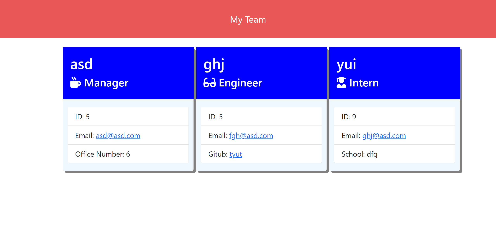

# team-profile-generator
   
    
  ## Description
  This is a command line application that the user can generate a team onto an HTML page.

  ## Table of Contents
  * [Installation](#installation)
  * [Usage](#usage)
  * [Credits](#credits)
  * [License](#license)
  * [Contributing](#Contributing)
  * [Test](#test)
  * [Questions](#questions)
  
  ## Installation
    1. Select a folder you would like to clone this repo to and clone it there.
    2. Install node.js.
    3. Install inquirer.
    4. From the command line run npm install.
    5. Install jest for testing.

  ## Usage
  You can check out a quick video on how it works at https://youtu.be/kRUHXePPjc8

  
  

  ## Credits
  https://www.w3schools.com/ https://stackoverflow.com/

  ## License
  This project is covered under the license of 
      [MIT](https://www.opensource.org/licenses/mit-license.php)
    .
  
  ## Contributing 
    Anyone can contribute. Just be nice.

  ## Test
  All the test on this project currently pass. Once you clone the project, try making your own test. Maybe you want to add a Freelancer to your project. Start with making 'Freelance.test.js' file. Initially, the test should all fail. Once this is complete, add a Freelnace.js file and write the code to make it pass.

  ## Questions
  You can contact to me at my GitHub profile, which is [Dmorrel7](https://github.com/Dmorrel7).
  You can also reach out to me by email daltonmorrel7@gmail.com